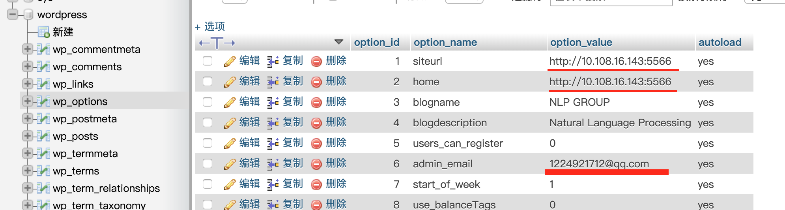
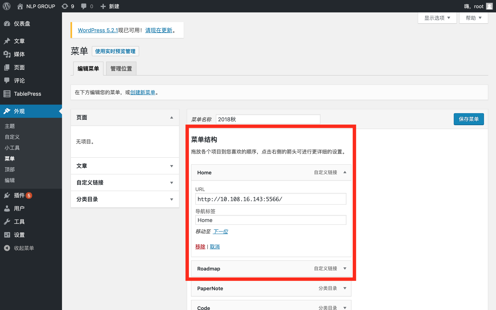
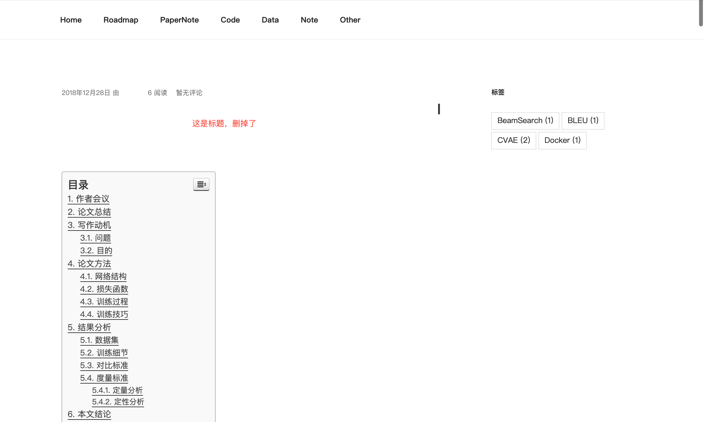
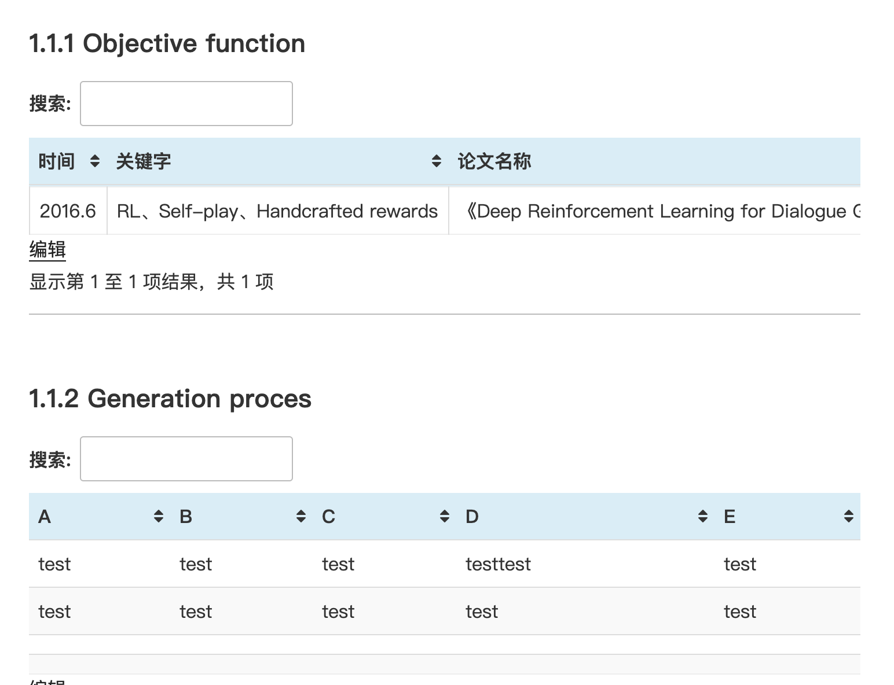
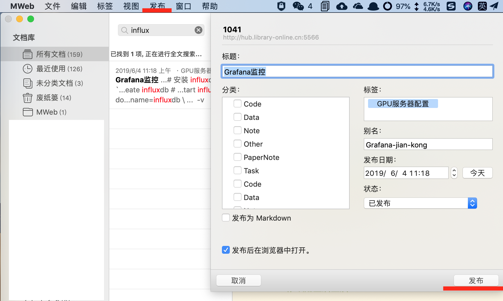

# wordpress_mysql_phpmyadmin
An practical and easy way to build wordpress

## install 

```
git clone https://github.com/Zhangxuri/wordpress_mysql_phpmyadmin.git
cd wordpress_mysql_phpmyadmin
docker-compose up
```
Default password for mysql is `password`

To run this command, wait a minute, then
1. wordpress: http://ip:5566
2. phpmyadmin: http://ip:5577

## how to use


1. Goto http://ip:5577 and use database `wordpress` select table `wp_options` and change the top2 line's `option_value` to your url and change the `admin_email`



2. Goto http://ip:5566 and username is `root`, password is `zxr`, and change the `Home` and `Roadmap` url



3. Enjoy it!

## Result
* [x]  干净整洁的界面
* [x]  全文搜索框
* [x]  文章按标签分类
* [x]  文章发表时间、阅读与评论数
* [x]  文章内部自动目录导航
* [x]  实用Mweb从md一键上传网站


---

---

---


